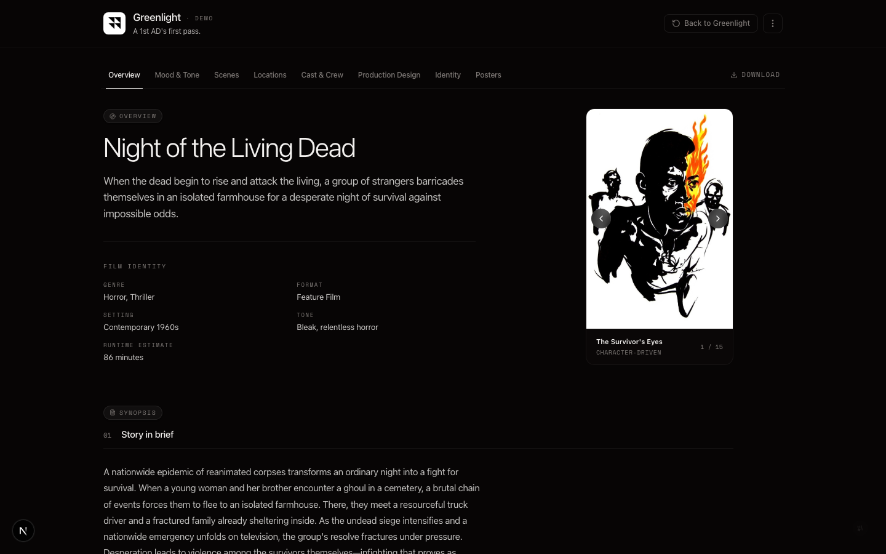

<h1 align="center">Greenlight</h1>
<p align="center">Script to vision deck in minutes.<br>
A conversation starter for filmmakers, not a production tool.</p>
<p align="center"><code>Next.js</code> <code>React 19</code> <code>Tailwind CSS 4</code> <code>Claude API</code> <code>FLUX + Gesture Draw LoRA</code></p>
<p align="center"><a href="https://greenlight.santiagoalonso.com"><strong>Try it live →</strong></a></p>



https://github.com/user-attachments/assets/e5fbef69-2bd7-43b3-858a-e4ef32b0c419

---

## What This Is

You have a script. Now what?

Greenlight helps you answer that question. You paste structured screenplay data and within minutes you have a vision deck — mood, visual references, storyboard sketches, poster concepts, and a sense of scope. Something tangible to put in front of collaborators before you have a crew, a schedule, or a budget.

It's not a production management tool. It's the thing that helps you figure out what the film *is* before you figure out how to make it.

## Who It's For

- **Directors** trying to articulate a visual language to their DP or production designer
- **Producers** assembling a pitch package or sizzle deck for a project
- **Small teams** who want a starting point for creative conversations

It sits upstream of StudioBinder, Movie Magic, and real pre-production workflows. Greenlight is for day one — before any of those tools are relevant.

## What You Get

| Tab | What It Does |
|---|---|
| **Overview** | Logline, taglines, synopsis, film identity, themes, scope at a glance |
| **Mood & Tone** | Atmosphere, tonal descriptors, color palette, music & sound direction, soundtrack references (TMDB posters), similar moods |
| **Scenes** | Scene-by-scene map with inline storyboard frames. Sequence or location grouping. |
| **Locations** | Unique locations grouped with scenes, time variations, and set requirements |
| **Cast & Crew** | Characters with AI portraits + production insights based on script complexity |
| **Production Design** | Cross-referenced props and wardrobe with reference sketches |
| **Title & Palette** | Color palette and title treatment with the full Google Fonts catalog |
| **Poster Concepts** | Visual directions across categories — conversation starters, not final art |

## What It Is Not

- **Not a production management tool.** No call sheets, no DOODs, no budgets, no scheduling.
- **Not a screenplay parser.** You bring structured data — the app generates the vision deck from it.
- **Not a replacement for StudioBinder or Movie Magic.** Those are for prep and production. This is for the phase before that.

## How It Works

1. **Extract + prompt** — Open [Gemini](https://gemini.google.com/app) (Pro model), upload your screenplay, and paste the built-in extraction prompt. Get structured JSON back.
2. **Paste** — Paste the JSON into Greenlight. On first use you're asked for your Claude and fal.ai keys (both stored locally in your browser, never on a Greenlight server).
3. **Review** — Your vision deck generates automatically. Claude docs and fal images run in parallel in the background. Edit, regenerate, iterate.

> **PDF upload** is visible in the UI as a coming-soon option. The happy path is Gemini → Paste JSON today.

## Image Generation

Storyboard frames, poster concepts, character portraits, and prop references are generated using FLUX dev + the [Gesture Draw LoRA](https://huggingface.co/glif/Gesture-Draw) (fal.ai) in a consistent black-ink-on-white-paper sketch style — every asset looks like it came from the same storyboard artist's hand. Use **Generate all images** in the More menu to batch-generate everything in one click.

## Setup

```bash
cd greenlight
npm install
npm run dev
```

Open [http://localhost:3001](http://localhost:3001).

### API Keys

Every API call is keyed by the end user, not by Greenlight. On first use the app pops a modal that saves your keys to `localStorage` — nothing touches a Greenlight server.

| Key | Purpose | Required? | Get one at |
|-----|---------|-----------|-----------|
| Claude API key | Document generation (Overview, Mood & Tone, Scenes, Storyboards, Poster Concepts) | **Required** | [console.anthropic.com](https://console.anthropic.com/settings/keys) |
| fal.ai API key | Image generation (storyboards, portraits, props, posters) | Optional — text-only deck without it | [fal.ai/dashboard](https://fal.ai/dashboard/keys) |
| TMDB API key | Poster thumbnails on Mood & Tone (Similar Moods, Soundtrack References) | Optional — tab works without it, just without poster thumbs | [themoviedb.org/settings/api](https://www.themoviedb.org/settings/api) |

For local development you can skip the modal by adding the same variables to `.env.local`:

```
ANTHROPIC_API_KEY=sk-ant-...
FAL_KEY=...
TMDB_API_KEY=...
```

Server-side env vars are used as a fallback when the user hasn't provided a key. On the public deployment no server-side keys are set, so every visitor must bring their own.

## Tech Stack

- **Framework:** Next.js 16, React 19, Tailwind CSS 4, shadcn/ui
- **AI:** Claude Haiku 4.5 (Anthropic), FLUX dev + Gesture Draw LoRA (fal.ai)
- **Data:** TMDB REST API for film reference lookups
- **Fonts:** Space Grotesk + Space Mono (UI), full Google Fonts catalog for title treatment
- **Theme:** Dark default with light mode toggle

## License

[All rights reserved](LICENSE)

---

Made by [santiagoalonso.com](https://santiagoalonso.com)
