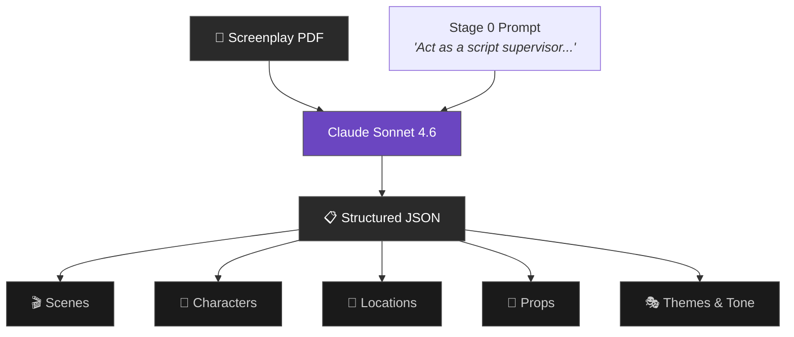
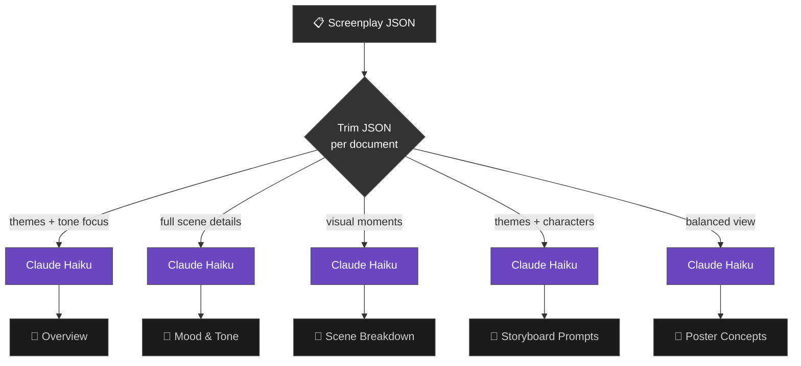
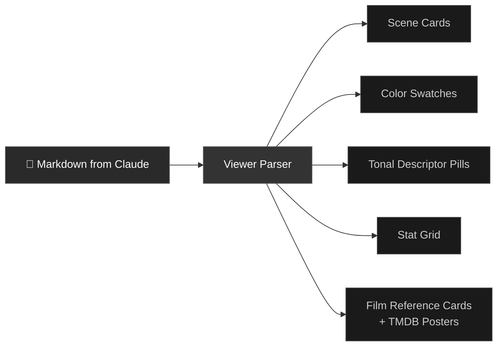
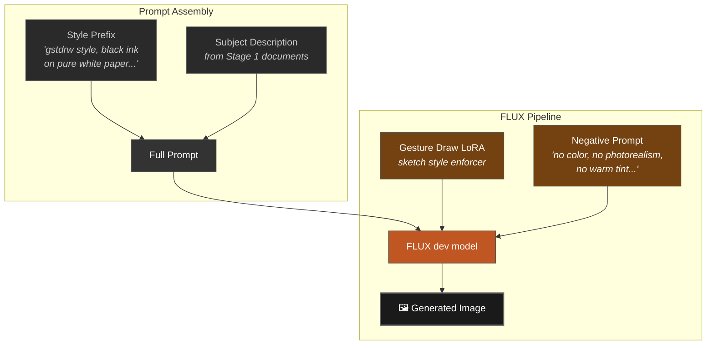
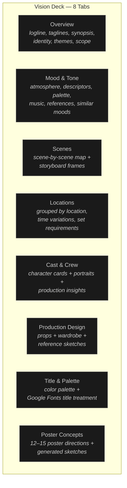
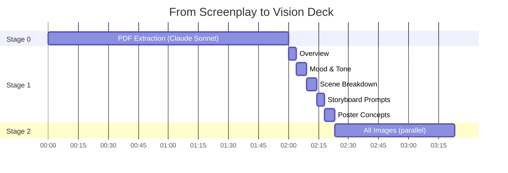

# How Greenlight Works

A plain-English walkthrough of what happens when you go from screenplay to vision deck.

---

## The Big Picture

Greenlight takes a screenplay and produces a **vision deck** — mood references, scene breakdowns, storyboard sketches, character portraits, and poster concepts. Three stages, three different AI models:


Each stage is independent. You can skip Stage 0 by pasting JSON manually. You can skip Stage 2 entirely and just use the written documents.

---

## Stage 0: Reading the Screenplay

> **Input:** PDF screenplay
> **Output:** Structured JSON (scenes, characters, locations, props, themes)
> **Model:** Claude Sonnet 4.6
> **Cost:** ~$0.66 · **Time:** 1–3 minutes

Claude Sonnet reads your PDF page by page and extracts everything a script supervisor would catalog:



### What gets extracted per scene

| Field | Example | Purpose |
|-------|---------|---------|
| `slug_line` | `EXT. CEMETERY - DUSK` | Standard screenplay scene heading |
| `page_start` / `page_end` | `2` / `10` | Script position for scheduling |
| `characters_present` | `["BARBARA", "JOHN"]` | Who's in the scene |
| `key_visual_moment` | *"The old man lunges at Barbara, ripping her clothing..."* | The single most striking image — feeds storyboard prompts |
| `emotional_beat` | *"Sudden terror and panic"* | The core emotional shift — shown on collapsed scene cards |
| `props` | `["flowered cross", "car keys", "stone"]` | What the art department needs |
| `wardrobe_notes` | `["John in shirtsleeves with a loosened tie"]` | What wardrobe needs to know |
| `vfx_stunts` | `["Car drifting and rolling backwards"]` | Flags for production insights |

### What gets extracted per character

| Field | Example |
|-------|---------|
| `name` | `BARBARA` (ALL CAPS, as written in script) |
| `description` | *"A young woman in her mid-twenties, easily frightened"* |
| `arc_summary` | *"Devolves from annoyed sister into traumatized, catatonic survivor"* |
| `scenes_present` | `[1, 2, 3, 4, 5, 6, 8, 9, 10, 11, 13]` |
| `special_requirements` | `["Extensive emotional acting (hysteria, catatonia)"]` |
| `wardrobe_changes` | `2` |

### What gets extracted globally

| Field | Example |
|-------|---------|
| `title` | *"Night of the Living Dead"* |
| `writer` | *"George A. Romero and John A. Russo"* |
| `genre` | `["Horror", "Thriller"]` |
| `setting_period` | *"Contemporary 1960s"* |
| `total_pages` | `86` |
| `themes` | `["Survivalism vs Panic", "Breakdown of Social Order"]` |
| `tone` | *"bleak relentless horror"* |

> **Alternative path:** Instead of uploading a PDF, you can paste JSON directly. The "Paste JSON" tab provides the extraction prompt so you can run it yourself in [Gemini](https://gemini.google.com/app) (free) and paste the result.

---

## Stage 1: Writing the Documents

Once Greenlight has the JSON, it calls Claude Haiku five times — once per document. Each call gets the same JSON but a different prompt telling Claude what to write and how.



> **Model:** Claude Haiku 4.5 (fast, cheap — ~$0.02 per document)
> **Total cost:** ~$0.10 for all 5 · **Total time:** ~15–20 seconds
> **Generated sequentially** with a progress bar

### Why trim the JSON?

Each document only needs part of the data. Sending the full JSON every time wastes tokens (= money). So each route trims:

| Document | What it gets | What's removed |
|----------|-------------|----------------|
| Overview | Everything (balanced) | Some prop/wardrobe detail |
| Mood & Tone | Themes, tone, key visuals, emotional beats | Detailed prop lists |
| Scene Breakdown | Full scene details | Character arcs |
| Storyboard Prompts | Key visual moments, emotional beats, locations | Wardrobe, props |
| Poster Concepts | Themes, tone, character arcs, settings | Scene-level detail |

---

### Document Details

Below is what each document produces and the voice the prompt sets for Claude.

---

#### 1. Overview

> *"This is the first thing a collaborator opens — it should read like the opening page of a 1st AD's first-pass breakdown. Treat it as a pitch artifact, not a spreadsheet."*

| Section | What it contains |
|---------|-----------------|
| **Logline** | Single compelling sentence, max 30 words |
| **Taglines** | 3 variations (visceral, thematic, enigmatic) |
| **Synopsis** | 150–200 words, spoiler-free |
| **Film Identity** | Genre, format, setting, tone, runtime estimate, writer credit |
| **Themes** | Each theme + 1–2 sentence explanation with scene references |
| **Scope at a Glance** | Scene count, locations, cast size, night shoots, VFX scenes, complexity read |

---

#### 2. Mood & Tone

> *"Write like a thoughtful cinephile, not a marketer. Avoid generic adjectives — go specific. Reference concrete moments from the scenes."*

| Section | What it contains |
|---------|-----------------|
| **Atmosphere** | 3–4 paragraph essay describing how the film should *feel* |
| **Tonal Descriptors** | 8–12 single words (e.g., *"asphyxiating · meat-and-bone realism · stop-motion dread"*) |
| **Color Palette** | 5 colors with hex codes, each tied to a specific scene/emotion |
| **Music & Sound** | 2–3 paragraphs on sonic texture + 4 real soundtrack references |
| **Reference Points** | 4–6 visual/tonal references (photographers, directors, painters) |
| **Similar Moods** | 4 films with the same *mood* (not plot), with TMDB poster art |

**This is the most important document** — it's where design sensibility shows.

---

#### 3. Scene Breakdown

> *"Generate a comprehensive Scene Breakdown document."*

The most straightforward document — it reformats the JSON into readable scene cards:

| Per scene | Example |
|-----------|---------|
| Slug line | `EXT. CEMETERY - DUSK` |
| Pages | `2-10` |
| Characters | `Barbara, John, Old Man` |
| Key Visual Moment | *"The old man lunges at Barbara..."* |
| Emotional Beat | *"Sudden terror and panic"* |
| Props, Wardrobe, VFX/Stunts, Notes | Listed when present |

Plus summary statistics (INT/EXT split, day/night ratio, VFX scene count).

---

#### 4. Storyboard Prompts

> *"Each prompt is designed to be used with an AI image generator to create storyboard frames."*

One image-generation prompt per scene. Claude writes vivid, cinematic descriptions — not "two people in a room" but the specific framing, lighting, wardrobe, and emotional weight:

> *"A dusk-lit cemetery scene with weathered gravestones and bare trees creating long shadows across the ground. An elderly man in tattered clothing lunges violently toward a young woman in a simple summer suit..."*

Each prompt includes:
- **Camera** — wide shot, close-up, OTS, bird's eye
- **Lighting** — natural, harsh, soft, candlelit
- **Mood** — 1–3 words

**These prompts feed directly into Stage 2** — they're what FLUX uses to draw storyboard sketches.

---

#### 5. Poster Concepts

> *"Generate MANY diverse ideas for movie poster designs. Quantity and variety matter more than perfection."*

12–15 distinct poster directions across 5–6 categories:

| Category | Style |
|----------|-------|
| **Character-Driven** | Close-up portraits, silhouettes, split-face |
| **Symbolic/Metaphorical** | Central object, abstract motif, negative space |
| **Scene-Based** | Iconic location, wide establishing shot |
| **Minimalist/Typographic** | Type-dominant, recursive nesting, distributed words |
| **Mood/Atmospheric** | Fog, decay, bokeh, chromatic aberration |
| **Collage/Ensemble** | Layered composites, multi-universe stacking |

Each concept includes: style, composition, 4-color palette with hex codes, typography direction, tagline, target audience, and a **ready-to-use AI image prompt**.

---

### How Documents Become UI

Claude returns raw markdown. The UI **parses** it into structured components:



Each viewer component (e.g., `overview-viewer.tsx`, `mood-and-tone-viewer.tsx`) has its own parser that reads the markdown structure — headings, bullet points, bold labels, hex codes — and renders them as interactive UI components. The markdown is the data format, not just display text.

This is why **inline editing works** — when you edit a field, the viewer updates the markdown, which re-parses into the updated UI.

---

## Stage 2: Drawing the Images

Images are generated **on demand** — not during the initial build. Click "Generate" on any placeholder, or "Generate all images" in the menu.



### The formula

Every image prompt follows the same pattern:

```
[STYLE PREFIX] + ". " + [SUBJECT DESCRIPTION]
```

- **Style prefix** = consistent visual instructions (B&W ink, sketch style, no color)
- **Subject description** = what to draw (comes from the generated documents)

### The four image types

| Type | Dimensions | Style prefix | Subject source | Example count |
|------|-----------|-------------|---------------|---------------|
| **Storyboard frame** | 1280×720 | *"rough lines, minimal background, storyboard sketch"* | Storyboard Prompts doc → each scene's `Prompt` field | ~13–30 per film |
| **Character portrait** | 720×720 | *"character portrait sketch, head and shoulders"* | JSON → `characters[].description` | ~8–10 per film |
| **Prop reference** | 720×720 | *"bold linework, close-up filling the frame, single object"* | JSON → `props_master[].item` + `.notes` | ~6–12 per film |
| **Poster concept** | 720×1008 | *"A24 arthouse, risograph print, dusty ochre and deep teal"* | Poster Concepts doc → each concept's `AI Prompt` field | 12–16 per film |

### Why all images look the same (on purpose)

Three things enforce visual consistency:

1. **Gesture Draw LoRA** — a model add-on trained on gesture drawings that biases FLUX toward hand-drawn ink sketches instead of polished photorealism
2. **Style prefix** — every prompt starts with `"gstdrw style, black ink on pure white paper..."` which triggers the LoRA
3. **Negative prompt** — blocks `"color, photorealistic, polished, 3d render, sepia, warm tint"` so nothing slips through

The result: every asset looks like it came from the same storyboard artist's sketchbook.

### Parallel generation

When you click "Generate all images," all tasks fire with 500ms staggered starts — not one-at-a-time. A full deck of ~67 images completes in ~60 seconds instead of ~35 minutes.

```
t=0.0s   → storyboard-1 starts
t=0.5s   → storyboard-2 starts
t=1.0s   → storyboard-3 starts
...
t=33.0s  → poster-16 starts (last task fired)
t=35.0s  → first results start landing
t=60.0s  → all images complete
```

---

## What You End Up With



Everything is editable inline. Documents can be regenerated section by section. Images can be regenerated individually. Prompts can be rewritten or edited by hand before regenerating. The whole deck persists in your browser.

---

## Where Data Lives

| What | Where | Persists? |
|------|-------|-----------|
| Input JSON | Browser localStorage | Until cleared |
| Generated documents (markdown) | Browser localStorage | Until cleared |
| Generated images | fal.ai CDN URLs | Temporary (hours) |
| Demo images (NotLD, EEAAO) | `public/demo-images/` (committed to git) | Permanent |
| API response cache | `.cache/` directory (dev only) | Until deleted |
| User settings (API keys, style prompts) | Browser localStorage | Until cleared |

---

## Cost Summary

| Stage | What | Model | Cost |
|-------|------|-------|------|
| 0 | PDF extraction | Claude Sonnet 4.6 | ~$0.66 |
| 1 | Overview | Claude Haiku 4.5 | ~$0.02 |
| 1 | Mood & Tone | Claude Haiku 4.5 | ~$0.02 |
| 1 | Scene Breakdown | Claude Haiku 4.5 | ~$0.02 |
| 1 | Storyboard Prompts | Claude Haiku 4.5 | ~$0.02 |
| 1 | Poster Concepts | Claude Haiku 4.5 | ~$0.02 |
| 2 | ~67 images | FLUX + Gesture Draw LoRA | ~$1.75 |
| — | TMDB poster lookups | TMDB API | Free |
| | | **Total per screenplay** | **~$2.50** |

> Skip the PDF upload and paste JSON manually (via Gemini, which is free) to drop to ~$1.85.

---

## End-to-End Timeline



**Total: ~3.5 minutes** from PDF to complete vision deck with all images.

---

## Key Files

If you want to modify how Greenlight works, these are the files that matter:

### Prompts (what Claude is told to write)

| File | Controls |
|------|----------|
| `lib/prompts/stage-0.ts` | What data gets extracted from the screenplay |
| `lib/prompts/overview.ts` | What the Overview document contains |
| `lib/prompts/mood-and-tone.ts` | What the Mood & Tone document contains |
| `lib/prompts/scene-breakdown.ts` | What the Scene Breakdown document contains |
| `lib/prompts/storyboard-prompts.ts` | What the storyboard image prompts describe |
| `lib/prompts/poster-concepts.ts` | What poster directions get generated |

### Image generation (what FLUX is told to draw)

| File | Controls |
|------|----------|
| `lib/image-prompts.ts` | Style prefixes, LoRA URL, negative prompt for all 4 image types |

### Infrastructure (how things connect)

| File | Controls |
|------|----------|
| `lib/claude.ts` | How Claude is called (model, retries, token limits) |
| `app/api/extract-screenplay/route.ts` | PDF upload → Claude Sonnet extraction |
| `app/api/generate/[slug]/route.ts` | JSON → Claude Haiku → markdown (one per document) |
| `app/api/generate-image/route.ts` | Prompt → FLUX → storyboard frame |
| `app/api/generate-portrait/route.ts` | Character description → FLUX → portrait |
| `app/api/generate-prop/route.ts` | Prop name → FLUX → reference sketch |
| `app/api/generate-poster-image/route.ts` | Poster concept → FLUX → poster sketch |

### Parsing (how markdown becomes UI)

| File | Controls |
|------|----------|
| `components/viewers/overview-viewer.tsx` | How Overview markdown → interactive cards |
| `components/viewers/mood-and-tone-viewer.tsx` | How Mood & Tone markdown → palette + film grids |
| `components/viewers/scene-breakdown-viewer.tsx` | How Scene Breakdown markdown → expandable cards |
| `components/viewers/poster-concepts-viewer.tsx` | How Poster Concepts markdown → concept cards |
