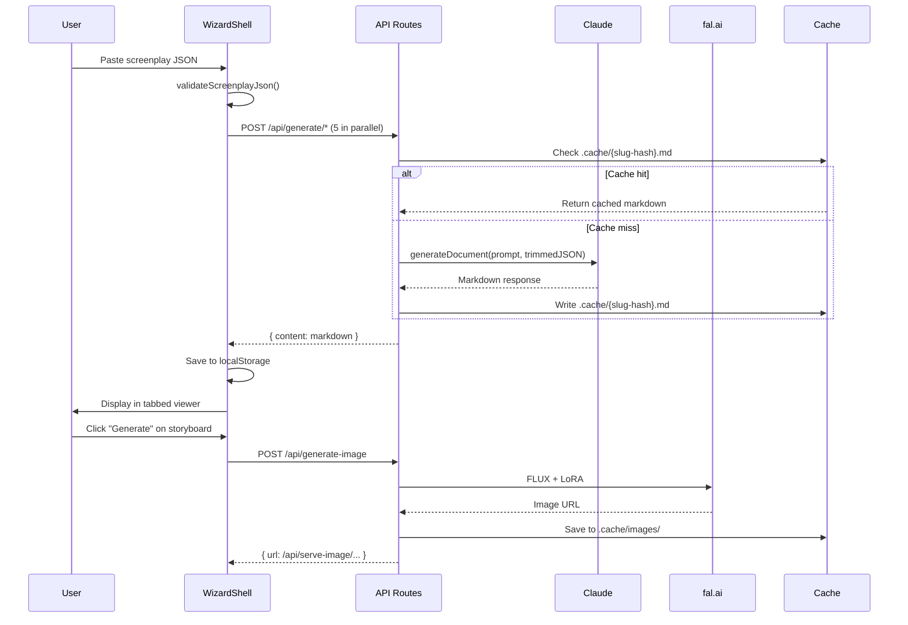

# Architecture

Greenlight is a single-page Next.js application with a 4-step wizard flow. There is no database — all state lives in localStorage. The backend consists of API routes that proxy calls to Claude (document generation) and fal.ai (image generation).

**Keys architecture:** On the public deployment (`greenlight-public.vercel.app`) no server-side API keys are set. Every paid route accepts `apiKey` in the body, with `process.env.X` as an optional local-dev fallback. The `ApiKeysProvider` wraps the app tree and exposes `ensureKeys({requireFal?})` which gates every user-triggered action — opening an onboarding modal if keys are missing and persisting them to localStorage once provided. Cached-project paths (title-matched demos) bypass the gate entirely.

## System Overview

```mermaid
graph TD
    UI[WizardShell<br/>React state + localStorage] -->|POST screenplay JSON| DocRoutes[5 Document API Routes<br/>Claude Haiku 4.5]
    UI -->|POST prompts| ImgRoutes[4 Image API Routes<br/>FLUX + Gesture Draw LoRA]
    UI -->|POST film titles| TMDB[TMDB Search Route]
    
    DocRoutes -->|markdown| Cache[File Cache<br/>.cache/*.md]
    DocRoutes -->|markdown| UI
    
    ImgRoutes -->|JPEG| ImgCache[Image Cache<br/>.cache/images/]
    ImgRoutes -->|/api/serve-image/| UI
    
    TMDB -->|poster URLs| UI
    
    UI -->|SavedProject JSON| LS[localStorage<br/>greenlight-project]
    
    Demo[/demo route] -->|reads| DemoSnap[lib/demo-project.ts<br/>+ public/demo-images/]
    Share[/share route] -->|reads| LS
```

## Component Architecture

The app has three layers:

1. **Wizard layer** (`components/wizard/`) — orchestrates the 4-step flow: instructions → JSON input → generation → results. `WizardShell` holds all state.

2. **Viewer layer** (`components/viewers/`) — 11 specialized components that parse markdown documents and screenplay JSON into structured UI. Each viewer owns its own parsing logic and image generation triggers.

3. **API layer** (`app/api/`) — stateless route handlers that proxy to external services. No business logic beyond prompt construction and caching.

## Request Lifecycle

A typical flow from "user pastes JSON" to "bible is displayed":



## Architectural Boundaries

| Boundary | What crosses it | Format |
|----------|----------------|--------|
| Browser → API routes | Screenplay JSON, prompts, API keys | JSON POST body |
| API routes → Claude | Trimmed JSON + system prompt | Anthropic SDK messages |
| API routes → fal.ai | Style prefix + subject prompt + LoRA config | fal.ai subscribe() |
| API routes → TMDB | Film title search queries | REST GET |
| API routes → filesystem | Cached markdown + images | File read/write |
| WizardShell → localStorage | Full SavedProject blob | JSON string |

## Key Architectural Patterns

- **Hybrid state** — WizardShell passes most state via prop drilling, but API keys live in a single `<ApiKeysProvider>` context (`lib/api-keys-context.tsx`) so any viewer or nested dialog can call `useApiKeys()` without threading props through StepResults.
- **Markdown as intermediate format** — Claude generates markdown, viewers parse it into structured data with regex. This decouples generation prompts from display logic.
- **File-based caching** — SHA256 hash of input JSON determines cache key. Same screenplay → instant results. Different screenplay → fresh generation.
- **Static demo snapshots** — `lib/demo-project.ts` (Night of the Living Dead) and `lib/demos/red-balloon.ts` (The Red Balloon) are committed SavedProjects with pre-generated images in `public/demo-images/`. The `/demo` and `/demo/red-balloon` routes read these directly, no API calls needed.
- **Parallel doc generation** — `step-generating.tsx` fires all 5 `/api/generate/*` routes concurrently via `Promise.all`, emitting `onDocReady(slug, content)` for each as it lands so dependent work (image generation for that doc's content) can start immediately.
- **Background image task queue** — `wizard-shell.tsx` runs a single-worker queue with dedupe Set, 500ms stagger, payment-error abort, and cancel support. Portraits + props auto-enqueue on JSON submit (if fal key present); storyboard + poster images enqueue when their parent Claude doc lands. Queue re-checks for new tasks after settling to avoid orphaning mid-settle enqueues.
- **Forgiving JSON extraction** (`extract-screenplay` route) — three-stage parse (raw → `\`\`\`json` fence → balanced-brace scan) recovers from Claude preamble/trailing prose. Streaming via `client.messages.stream().finalMessage()` bypasses the SDK's 10-minute non-streaming cap.
- **SEO via Next.js metadata API** — root `metadataBase` + per-page `export const metadata`. `app/robots.ts` and `app/sitemap.ts` auto-generate `/robots.txt` + `/sitemap.xml` using `getSiteUrl()`.
