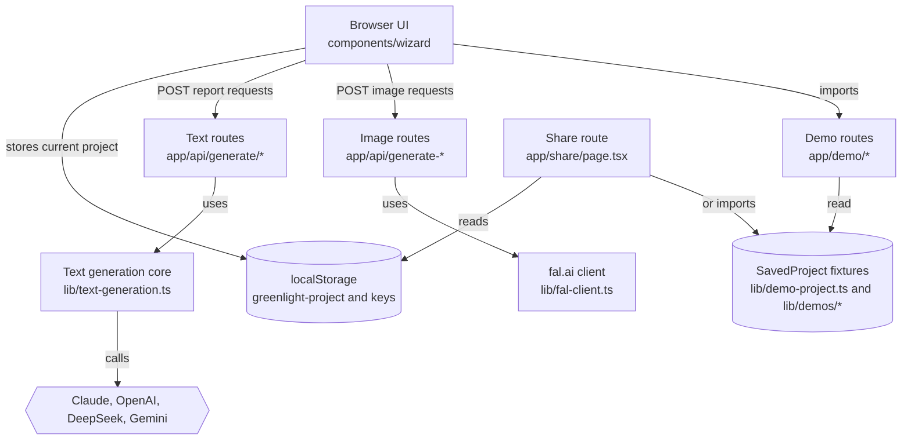
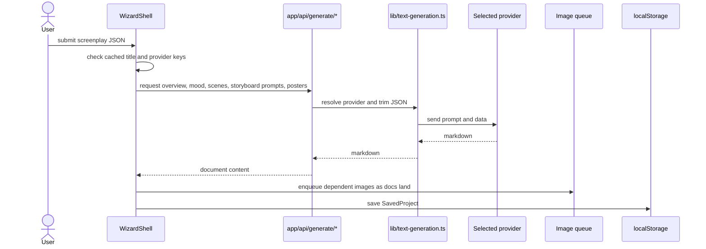

# Architecture

Greenlight is a single Next.js app with three main surfaces: the live wizard at `/`, committed demo routes under `/demo`, and a print/share surface at `/share`. The architecture is intentionally small: browser state holds one active project, Next route handlers proxy provider calls, and TypeScript fixture modules hold demo projects.

## System Overview

## Request Lifecycle

## Main Boundaries

| Boundary | Files | Responsibility |
|---|---|---|
| App shell | `app/layout.tsx`, `app/page.tsx`, `components/wizard/wizard-shell.tsx` | Home page, provider context, JSON submission, generation state |
| Report viewer | `components/wizard/step-results.tsx`, `components/viewers/*` | Eight-tab report UI and markdown parsing |
| Text API layer | `app/api/generate/*/route.ts`, `app/api/regenerate-section/route.ts` | Prompt execution through selected provider |
| Text provider core | `lib/text-generation.ts`, `lib/ai-providers.ts`, `lib/claude.ts` | Provider selection, retries, model defaults |
| Image API layer | `app/api/generate-image/route.ts`, `generate-portrait`, `generate-prop`, `generate-poster-image` | fal.ai FLUX LoRA requests |
| Demo system | `app/demo/*`, `components/demo/demo-content.tsx`, `lib/demos/*` | Read-only committed snapshots |
| Share system | `app/share/page.tsx`, `components/share/shareable-view.tsx` | Printable full-bible page from live or demo source |
| Prompt tooling | `prompt-tests/scripts/*` | Fixture generation, prompt comparison, visual QA |

## Architectural Pattern

The app is a client-heavy single-project workflow with serverless provider proxies. The browser owns the interactive project state, while route handlers own provider calls that need secret handling, retries, and cross-origin safety. This fits a portfolio demo because it avoids accounts, databases, and backend storage while still supporting a real generation flow.

## Evidence

- `components/wizard/wizard-shell.tsx` defines the one-project wizard state, API-key flow, and image queue.
- `lib/reports.ts` defines `SavedProject` and the `greenlight-project` localStorage key.
- `app/api/generate/*/route.ts` files each trim screenplay JSON, call a prompt, and cache the response in memory.
- `app/share/page.tsx` chooses a demo fixture from the query string or falls back to the active local project.
- `prompt-tests/scripts/build-demo-fixture.mjs` creates committed demo fixtures from raw screenplay JSON.

