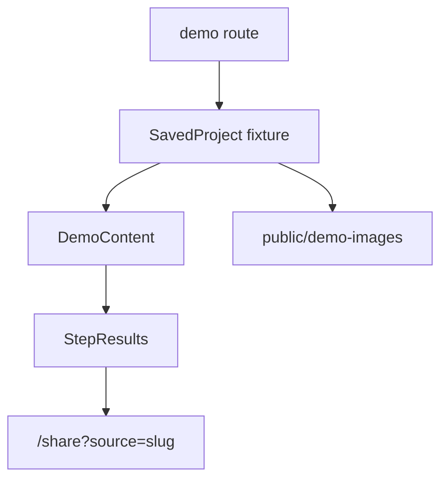

# Demo System

## Purpose

The demo system lets Greenlight show complete, polished film decks without live provider calls. It is the product's portfolio surface.

## Location

- `app/demo/page.tsx`
- `app/demo/*/page.tsx`
- `components/demo/demo-content.tsx`
- `lib/demo-project.ts`
- `lib/demos/*`
- `public/demo-images/*`
- `app/share/page.tsx`

## Flow

## Current Visible Demos

The visible demo set is Night of the Living Dead, Get Out, Dune: Part One, The Favourite, Past Lives, and The Red Balloon. There is also an EEAAO cached-project path in `lib/cached-projects.ts`, used for title-matched fake generation rather than a visible route.

## Constraints

- Fixture modules are large and should be treated carefully in diffs.
- Public image folders currently contain hundreds of generated files.
- Share route mappings must be updated when adding a demo.
- Sitemap and landing-card entries also need updates for new demos.

