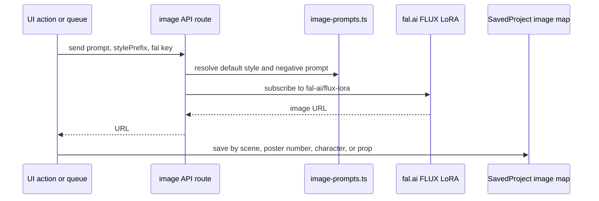

# Image Generation

## Purpose

Image generation creates sketch-style storyboards, portraits, prop studies, and poster concepts. All current AI images use a Gesture Draw LoRA style on fal.ai.

## Location

- `lib/image-prompts.ts`
- `lib/fal-client.ts`
- `app/api/generate-image/route.ts`
- `app/api/generate-portrait/route.ts`
- `app/api/generate-prop/route.ts`
- `app/api/generate-poster-image/route.ts`
- `components/wizard/wizard-shell.tsx`

## Flow

## Style Defaults

The default storyboard, portrait, and prop prompts are black ink on pure white paper with no color. Poster prompts use a more A24 arthouse risograph direction, but all routes still share the same LoRA constants.

## Constraints

- fal.ai key is optional for text-only decks.
- Missing images should not block report reading.
- Demo text reruns should preserve image maps unless images are intentionally regenerated.

