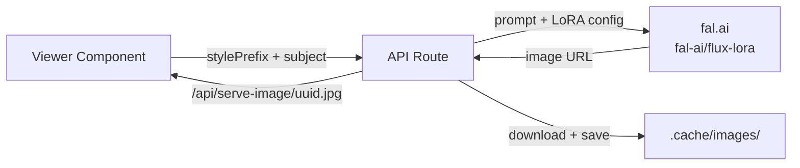

# Image Generation Pipeline

## Purpose

Greenlight generates four types of images — storyboard frames, character portraits, prop references, and poster concepts — all using the same FLUX model with a Gesture Draw LoRA to produce consistent B&W gesture sketches.

## Architecture



## Configuration

All shared constants live in `lib/image-prompts.ts`:

| Export | Value |
|--------|-------|
| `GESTURE_DRAW_LORA_URL` | `huggingface.co/glif/Gesture-Draw/.../Gesture_Draw_v1.safetensors` |
| `GESTURE_DRAW_LORA_SCALE` | `1.0` |
| `IMAGE_NEGATIVE_PROMPT` | Blocks color, photorealism, sepia, warm tint, rendering |
| `DEFAULT_IMAGE_PROMPTS` | Per-kind style prefixes (see below) |

## Per-Kind Configuration

| Kind | Style Prefix | Image Size | Route |
|------|-------------|-----------|-------|
| Storyboard | `gstdrw style, black ink on pure white paper, rough lines, expressive strokes, minimal background, storyboard sketch...` | 1280x720 | `/api/generate-image` |
| Portrait | `gstdrw style, black ink on pure white paper, rough lines, expressive strokes, minimal background, character portrait sketch, head and shoulders...` | 720x720 | `/api/generate-portrait` |
| Prop | `gstdrw style, black ink on pure white paper, bold linework, expressive strokes, close-up view filling the frame, single object study...` | 720x720 | `/api/generate-prop` |
| Poster | `gstdrw style, black ink on pure white paper, rough lines, expressive strokes, minimal background, poster composition sketch...` | 720x1008 | `/api/generate-poster-image` |

Props use "bold linework, close-up filling the frame" instead of "rough lines, minimal background" because the Gesture Draw LoRA renders isolated objects too sparsely at its default gestural strength.

## Prompt Assembly

Every route follows the same pattern:

```
[STYLE_PREFIX from Settings or default]. [subject text from viewer]
```

The LoRA trigger word `gstdrw style` at the start of the style prefix is what activates the Gesture Draw style. The `negative_prompt` parameter blocks color and photorealism from leaking through subject text that may contain lighting/color descriptions.

## fal.ai Call Shape

```typescript
fal.subscribe("fal-ai/flux-lora", {
  input: {
    prompt: fullPrompt,
    negative_prompt: IMAGE_NEGATIVE_PROMPT,
    loras: [{ path: GESTURE_DRAW_LORA_URL, scale: GESTURE_DRAW_LORA_SCALE }],
    image_size: { width, height },
    num_images: 1,
    num_inference_steps: 28,
    guidance_scale: 3.5,
  }
})
```

The fal.ai SDK types don't include `negative_prompt` or `loras` yet (types lag behind the API), so the input object uses `as never` type assertion.

## User Customization

Users can override style prefixes per kind via the Settings dialog. Overrides are stored in `localStorage["greenlight-image-prompts"]`. The `getStylePrefix(kind)` function checks localStorage first, falls back to `DEFAULT_IMAGE_PROMPTS[kind]`.

The LoRA, scale, steps, guidance, and negative prompt are NOT user-configurable — they're hardcoded in the API routes. This is intentional: the LoRA config was extensively A/B tested and the current settings produce the best results across all subject types.

## Costs

| Provider | Model | Cost | Speed |
|----------|-------|------|-------|
| fal.ai | `fal-ai/flux-lora` (FLUX dev + LoRA) | $0.035/image | ~5-15s first call (LoRA load), ~3-6s after |

Typical bible: ~42 images = ~$1.47

## Why Gesture Draw LoRA?

Extensive A/B testing across 4 FLUX model tiers (schnell, dev, pro v1.1, pro v1.1 ultra) and multiple prompt strategies showed that:

1. **Prompt-only approaches fail** — FLUX models are trained to produce polished output. No amount of "rough sketch" prompt text overcomes this bias with colorful subject descriptions.
2. **The LoRA forces the style** — the Gesture Draw LoRA was trained on gesture drawing and reliably produces B&W sketchy output regardless of subject content.
3. **Dev + LoRA beats Ultra without LoRA** — at lower cost ($0.035 vs $0.06) with equivalent visual quality.
4. **Scale 1.0 / 28 steps is the sweet spot** — higher scale (1.3+) produces artifacts; fewer steps (<12) produces unreadable output.

## Related

- [Viewers](Viewers.md) — components that trigger image generation
- [Configuration](../Configuration.md) — environment variables for fal.ai
- [Design Decisions](../Design-Decisions.md) — full rationale for LoRA choice
