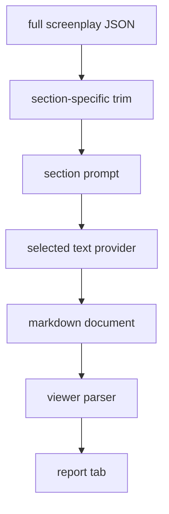
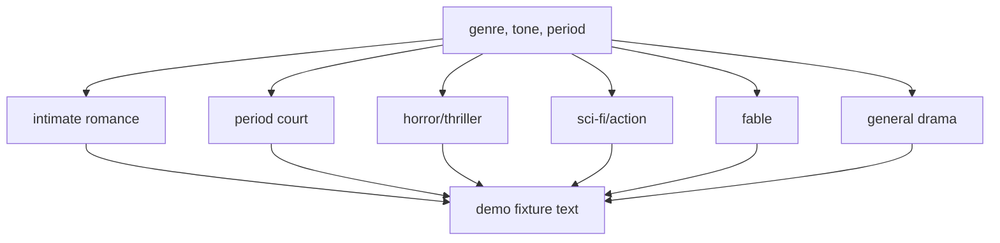

# Prompt Pipeline

## Purpose

The prompt pipeline turns screenplay JSON into report markdown. The live app uses provider prompts, while local demo regeneration can use a genre-aware fixture writer.

## Location

- `lib/prompts/*`
- `lib/json-trimmer.ts`
- `lib/text-generation.ts`
- `app/api/generate/*/route.ts`
- `app/api/regenerate-section/route.ts`
- `prompt-tests/scripts/build-demo-fixture.mjs`
- `prompt-tests/scripts/compare-role-passes.mjs`

## Live Generation Flow

## Local Demo Genre Lanes

## Why This Matters

The latest pipeline change fixed a product-level problem: unrelated demos were reading like they came from the same generic template. The local fixture writer now adapts language, references, palettes, taglines, and poster concepts by film lane.

## Constraints

- The local fixture writer is not the same thing as the live provider prompts.
- It is now important enough that prompt/report changes need text audits.
- The current horror lane still needs a split between siege/survival horror and social/psychological horror.

