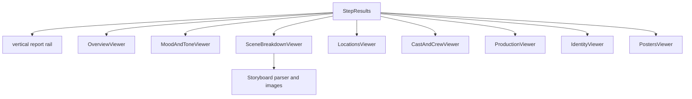

# Report Viewers

## Purpose

Report viewers parse generated markdown and raw JSON into the eight visible film-deck tabs.

## Location

- `components/wizard/step-results.tsx`
- `components/viewers/overview-viewer.tsx`
- `components/viewers/mood-and-tone-viewer.tsx`
- `components/viewers/scene-breakdown-viewer.tsx`
- `components/viewers/storyboard-viewer.tsx`
- `components/viewers/locations-viewer.tsx`
- `components/viewers/cast-and-crew-viewer.tsx`
- `components/viewers/production-viewer.tsx`
- `components/viewers/identity-viewer.tsx`
- `components/viewers/posters-viewer.tsx`

## Composition

## Important Behavior

- `StepResults` defines the eight report tabs and keyboard navigation.
- Markdown parsers are colocated with the viewer that consumes the markdown.
- Derived tabs use JSON directly, so they stay useful even when some generated prose is thin.
- Bottom navigation uses `ReportSectionNav` for previous/next report sections.

## Constraints

The viewer layer depends on stable markdown headings. Prompt edits should be followed by parser-aware smoke tests.

