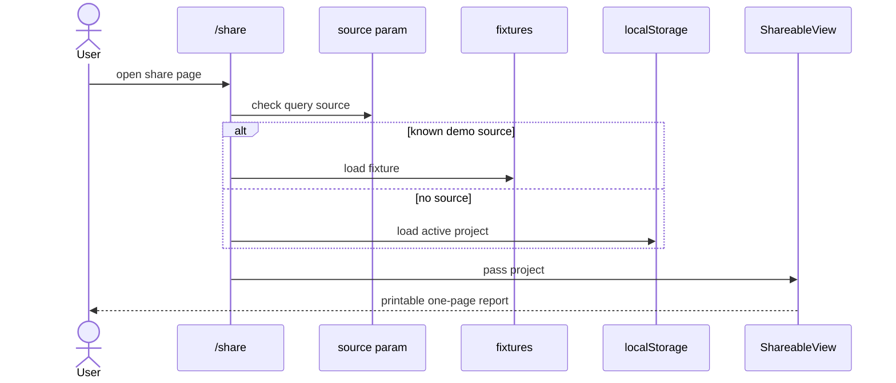

# Share And Export

## Purpose

The share view converts a tabbed report into one long, printable film bible.

## Location

- `app/share/page.tsx`
- `components/share/shareable-view.tsx`
- parsers imported from `components/viewers/*`

## Flow

## Design Notes

The share page intentionally uses a light presentation mode and print styles. It expands content that is tabbed or collapsible in the interactive report.

## Constraints

- It must stay parser-compatible with the same generated markdown used by the viewer tabs.
- It does TMDB poster lookup client-side for references when possible.

