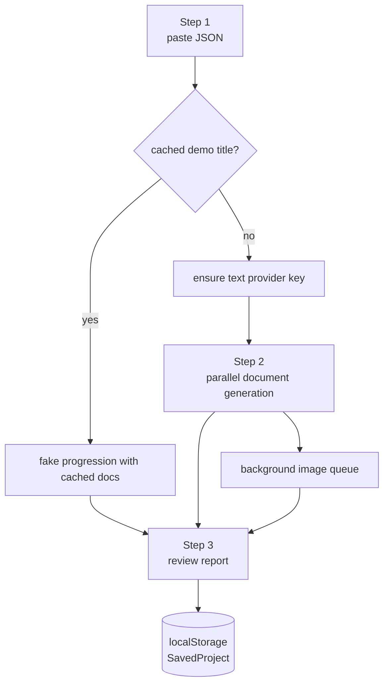

# Wizard

## Purpose

The wizard is the live generation surface. It accepts screenplay JSON, checks keys, runs text generation, schedules image generation, and saves one active project to browser storage.

## Location

- `components/wizard/wizard-shell.tsx`
- `components/wizard/step-instructions.tsx`
- `components/wizard/step-generating.tsx`
- `components/wizard/step-results.tsx`
- `components/wizard/api-keys-dialog.tsx`
- `lib/api-keys-context.tsx`

## Internal Flow

## Interface

`WizardShell` owns project-level state and passes data into `StepGenerating` and `StepResults`. `ApiKeysProvider` wraps the app in `app/layout.tsx` and exposes `ensureKeys`.

## Constraints

- Only one active project is stored.
- Key handling is browser-local.
- Image generation is opportunistic. Text generation can complete without images.

