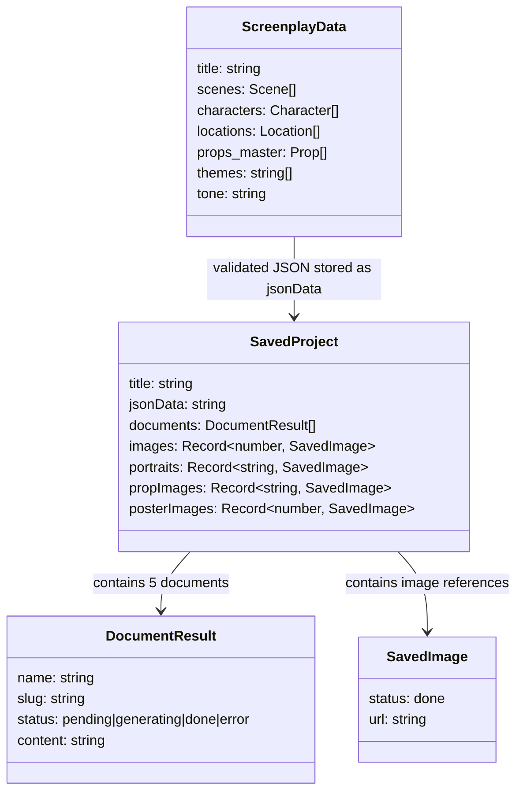

# Core Concepts

## Domain Glossary

| Term | Definition |
|------|-----------|
| **Pre-production bible** | A collection of documents that brief every film department before shooting begins — overview, mood board, scene breakdown, visual references |
| **Screenplay JSON** | Structured extraction of a screenplay into scenes, characters, locations, and props. Created manually using the Stage 0 prompt in Claude.ai or ChatGPT with the screenplay PDF |
| **Stage 0** | The manual extraction step — user uploads their screenplay PDF to an LLM with the extraction prompt (`lib/prompts/stage-0.ts`), gets back structured JSON |
| **Document** | One of 5 generated markdown files: Overview, Mood & Tone, Scene Breakdown, Storyboard Prompts, Poster Concepts |
| **Viewer** | A React component that parses a generated markdown document (or raw JSON data) into structured UI cards |
| **SavedProject** | The localStorage blob containing everything: screenplay JSON, generated documents, image URLs, user overrides |
| **Style prefix** | The prompt text prepended to every image generation call — controls the visual style (Gesture Draw LoRA trigger + B&W instructions) |
| **Hero prop** | A prop with narrative significance (appears in multiple scenes, is a plot device) — flagged in the screenplay JSON |
| **Insights** | Situational production advice derived from the screenplay — specialty crew needs that only surface when the script justifies them (stunts, VFX, weapons, minors, etc.) |

## Key Abstractions

## Mental Model

**Three-phase pipeline:**

1. **Extract** (manual) — user runs screenplay PDF through Claude.ai with Stage 0 prompt → gets ScreenplayData JSON
2. **Generate** (automated) — Greenlight sends JSON to Claude Haiku 4.5 → gets 5 markdown documents. Sends scene descriptions to FLUX + LoRA → gets images.
3. **Browse** (interactive) — viewers parse markdown into structured UI. User can regenerate sections, shuffle taglines, generate images one-by-one or in bulk, toggle items on/off.

**Two types of content:**

- **Text documents** — generated by Claude, parsed by viewers using regex. Each document has a specific markdown structure that the corresponding viewer knows how to parse.
- **Images** — generated by FLUX via fal.ai with the Gesture Draw LoRA. Stored as JPEGs in `.cache/images/`, referenced by URL in SavedProject.

**Everything is disposable.** Documents can be regenerated from the same JSON. Images can be regenerated from the same prompts. The screenplay JSON is the single source of truth.
