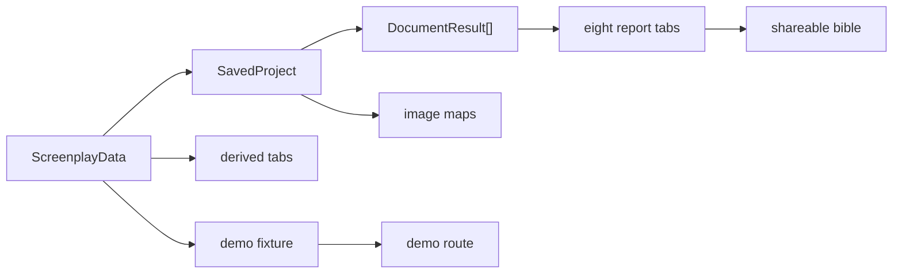

# Core Concepts

Greenlight is easiest to understand as a conversion pipeline: script facts become report prose, report prose becomes a visual deck, and selected report sections become image prompts.

## Concept Map

## Domain Glossary

| Term | Meaning | Evidence |
|---|---|---|
| `ScreenplayData` | The structured script schema with title, scenes, characters, locations, props, themes, and tone | `lib/schema.ts` |
| `SavedProject` | The persisted project shape containing JSON, generated markdown documents, and image maps | `lib/reports.ts` |
| `DocumentResult` | Client-side status wrapper for one generated document | `components/wizard/wizard-shell.tsx` |
| Text provider | Claude, OpenAI, DeepSeek, or Gemini, selected by the user | `lib/ai-providers.ts` |
| Image prompt kind | Storyboard, portrait, prop, or poster image style | `lib/image-prompts.ts` |
| Fixture | A committed `SavedProject` module used by a demo route | `lib/demo-project.ts`, `lib/demos/*` |
| Share source | Query-string selector for a fixture on `/share` | `app/share/page.tsx` |
| Genre lane | Local fixture-writing profile selected from genre/tone/period | `prompt-tests/scripts/build-demo-fixture.mjs` |

## The Important Split

Greenlight has five generated documents but eight visible sections.

| Visible tab | Source |
|---|---|
| Overview | `overview` markdown |
| Mood & Tone | `mood-and-tone` markdown |
| Scenes | `scene-breakdown` markdown plus `storyboard-prompts` and image map |
| Locations | Original JSON |
| Cast & Crew | Original JSON plus portraits |
| Production Design | Original JSON plus prop images |
| Title & Palette | Mood palette, title data, title-font logic |
| Poster Concepts | `poster-concepts` markdown plus poster images |

## Mental Model

1. The JSON is the source of truth for facts.
2. Generated markdown is the source of truth for taste and interpretation.
3. Images are replaceable visual references, not authoritative production assets.
4. Demo fixtures are snapshots of a good run, not a database.
5. Prompt tests are the workshop for improving the workflow without touching the live UI.

