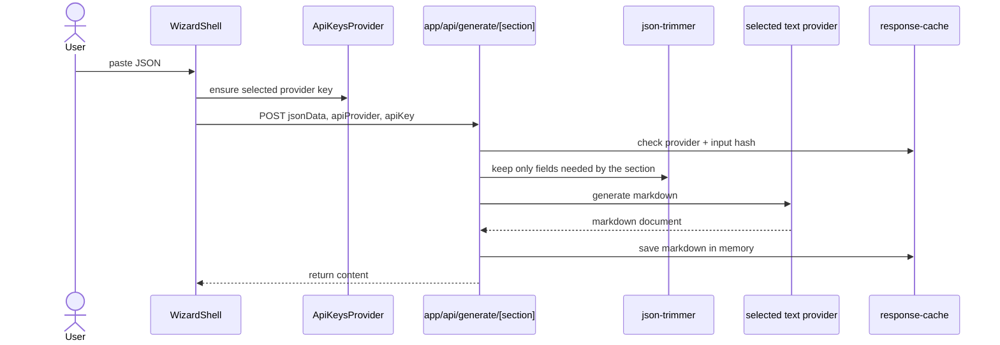
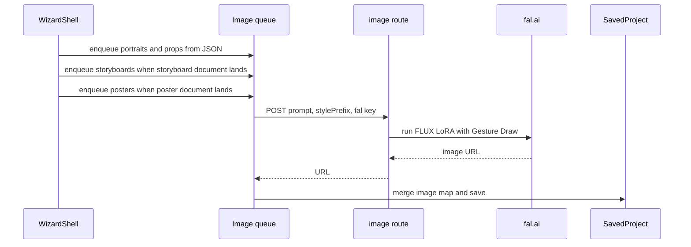
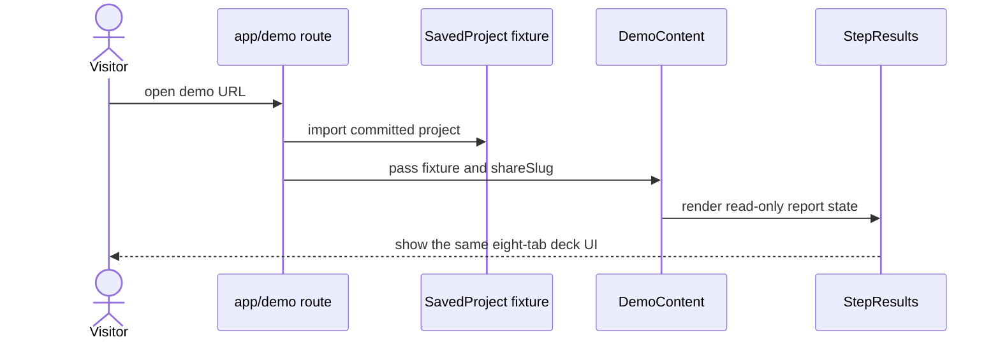
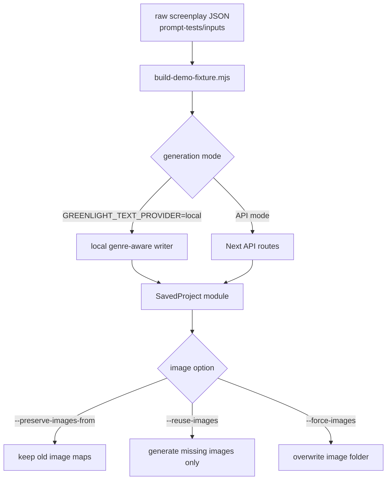
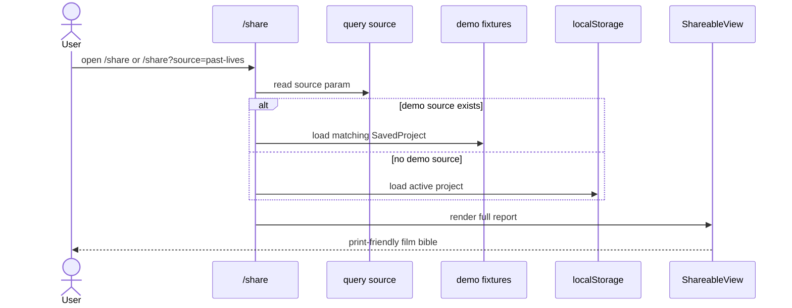

# Data Flow

Greenlight has four important flows: live report generation, image generation, committed demo rendering, and local fixture regeneration.

## Live Text Generation

Five text documents are generated: Overview, Mood & Tone, Scene Breakdown, Storyboard Prompts, and Poster Concepts. `StepResults` turns those five documents plus raw JSON into eight visible tabs.

## Live Image Generation

The queue starts tasks with a 500ms stagger but does not wait for each task to finish before starting the next one. Results are merged through refs to avoid clobbering concurrent completions.

## Demo Rendering

Demo routes do not call text providers or fal.ai. They import a `SavedProject` object and reference committed images under `public/demo-images`.

## Text-Only Fixture Regeneration

This is the workflow behind the latest demo report refresh. It lets the text improve without paying for images or accidentally overwriting existing image sets.

## Share Flow

