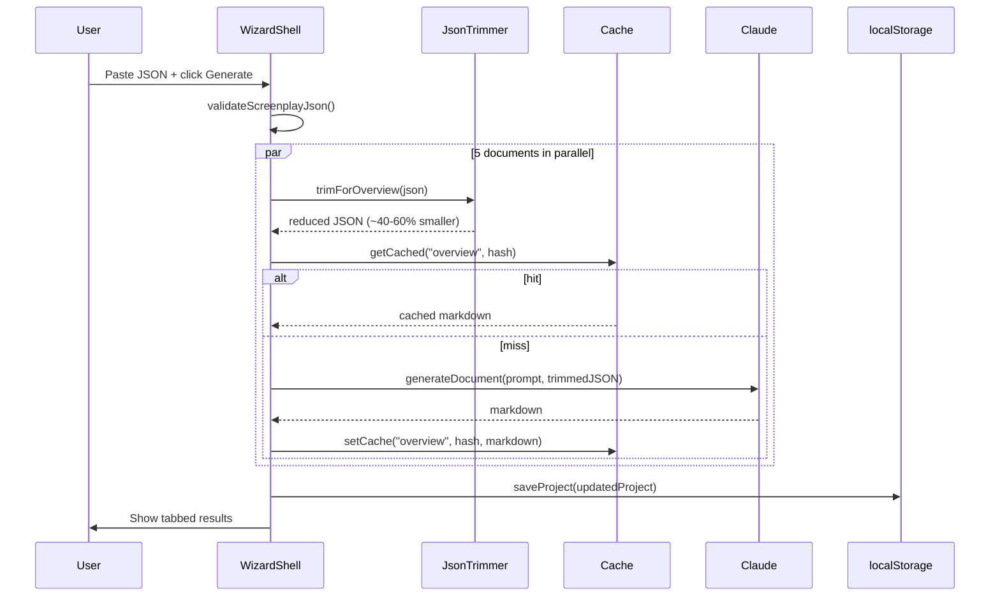
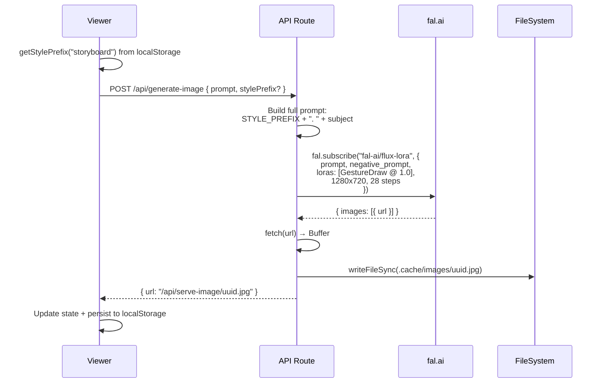
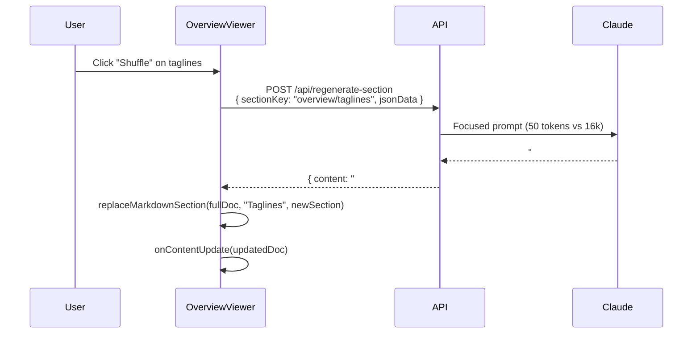

# Data Flow

## Flow 1: JSON → Documents (Generation)

The core pipeline from screenplay JSON to five department-ready documents.



### Token Trimming

Each document gets a different subset of the screenplay JSON. This keeps Claude under its 16384 token limit:

| Document | Fields kept | Fields dropped | Typical reduction |
|----------|-----------|---------------|-------------------|
| Overview | All top-level, themes, characters (names only), locations (names only), scene count | Full scene details, props, wardrobe | ~60% |
| Mood & Tone | Tone, themes, key_visual_moment per scene, emotional_beat, music_cue | Props, wardrobe, page numbers | ~50% |
| Scene Breakdown | Full scenes, characters, locations | Props (kept inline per scene) | ~20% |
| Storyboard Prompts | Scenes (visual + emotional fields only), characters (descriptions) | Locations, props_master, themes | ~55% |
| Poster Concepts | Title, genre, tone, themes, characters (names + descriptions), key visual moments | Full scene data, locations, props | ~65% |

## Flow 2: Prompt → Image (Storyboard Generation)

How a single storyboard frame gets generated.



## Flow 3: Section Regeneration (Hotswap)

How a user shuffles taglines without regenerating the full Overview document.



## State Shape

All state lives in `WizardShell` and flows down via props:

```
WizardShell state
├── step: 1 | 2 | 3 | 4
├── jsonData: string (raw screenplay JSON)
├── documents: DocumentResult[] (5 generated markdown docs)
├── images: Record<sceneNumber, SavedImage> (storyboard frames)
├── promptOverrides: Record<sceneNumber, string> (edited storyboard prompts)
├── posterImages: Record<conceptIndex, SavedImage>
├── portraits: Record<characterName, SavedImage>
├── propImages: Record<propName, SavedImage>
├── disabledItems: Record<string, boolean> (hidden cast/insight cards)
└── imagePrompts: Record<ImagePromptKind, string> (user style overrides)
```

On every state change, `saveProject()` writes the full blob to `localStorage["greenlight-project"]`.
