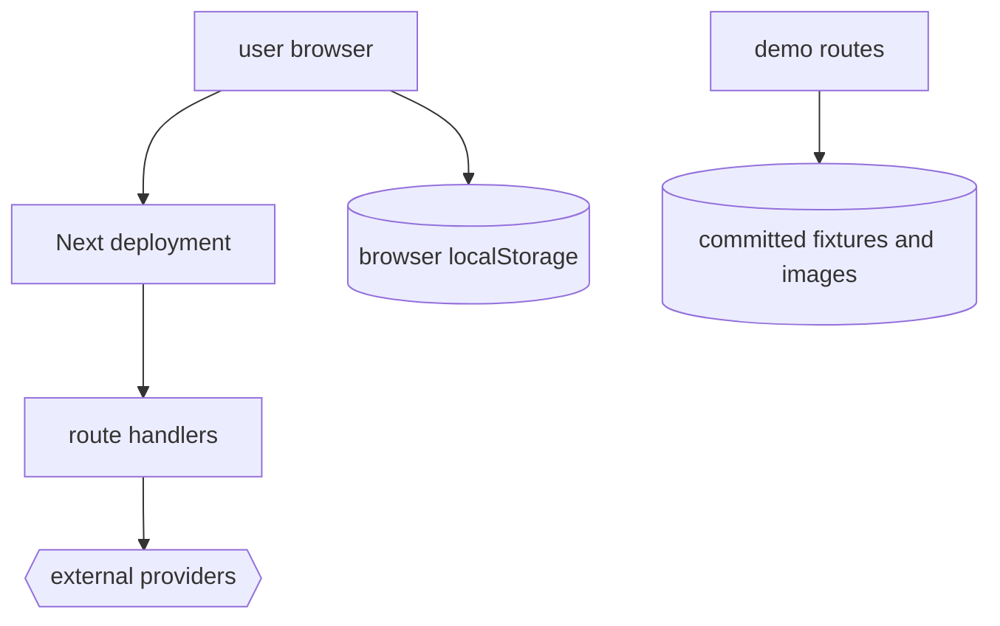

# Deployment

Greenlight is a standard Next.js deployment target. The repo is public, but the hosted deployment is intentionally not promoted in README copy because fresh generation can depend on user-supplied keys or san's private provider setup.

## Build

```bash
npm run build
```

## Runtime Model



## Security And Privacy Notes

- User-supplied provider keys live in browser localStorage.
- Keys are sent to serverless route handlers only when needed.
- No server-side database is used.
- `/api/save-local` is development-only.
- Production headers are configured in `next.config.ts`.
- The password gate exists but is optional through `ACCESS_PASSWORD`.

## What To Verify Before A Push Or Deploy

1. `git status` for untracked assets.
2. `npm run lint`.
3. `npm run build`.
4. Smoke routes for `/`, `/demo`, all named demos, and `/share` sources.
5. Confirm README does not advertise private deployment URLs.

