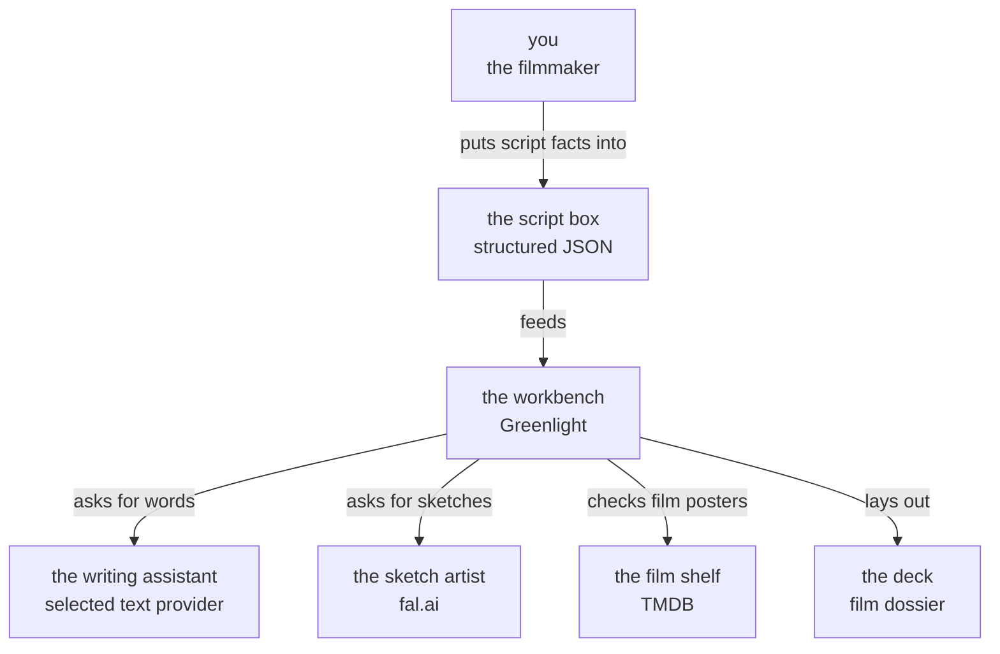
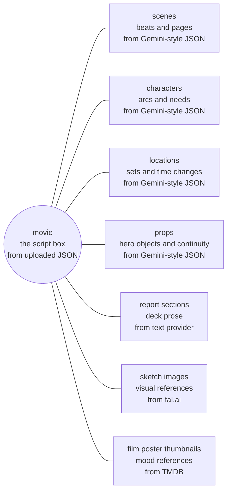
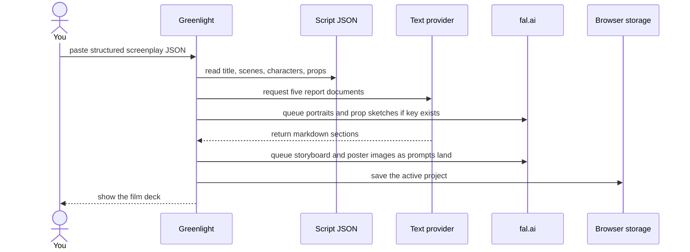
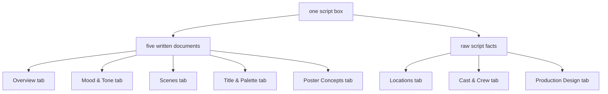
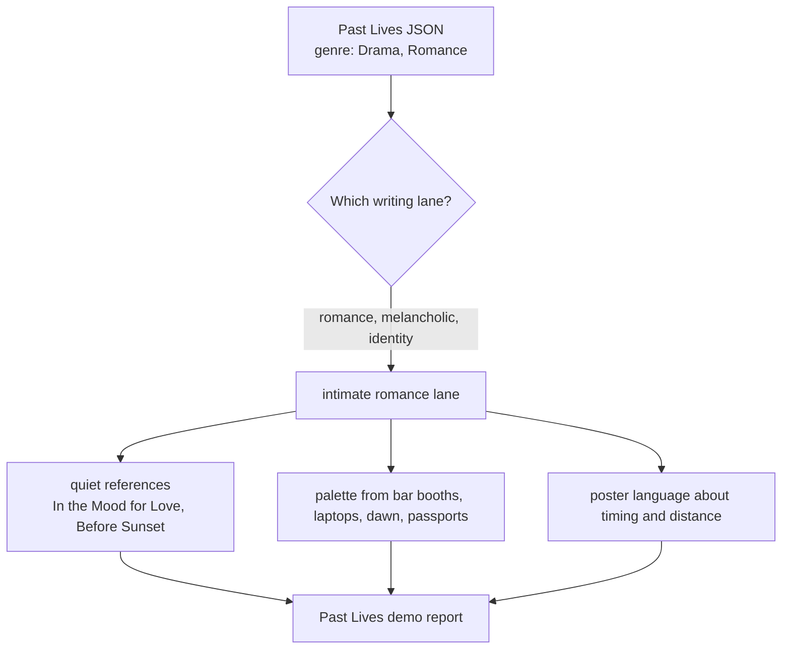
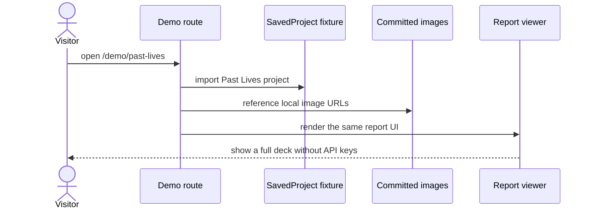

# Greenlight, Explained Simply

**If you take one thing from this page: Greenlight is a small film-studio workbench that turns one organized script file into a first visual pitch deck.** Imagine a workbench in a film office. You put a labeled script box on the bench. The bench asks a writing assistant to draft the deck, asks a sketch artist to draw visual references, then lays everything out as a readable film dossier.

## The Big Picture

You start with a script that has already been turned into structured JSON. That file lists scenes, characters, locations, props, themes, tone, and page counts. Greenlight turns that one file into eight deck sections: overview, mood, scenes, locations, cast, production design, title/palette, and poster concepts. Some sections are written by a text provider. Some are derived directly from the JSON. Images come from the sketch artist service when a fal.ai key is available.

## Where The Material Comes From

| What you see | Where it comes from | Notes |
|---|---|---|
| Logline, synopsis, themes | Text provider using trimmed screenplay JSON | Live app calls `/api/generate/overview` |
| Mood, references, soundtrack ideas | Text provider using genre, tone, scene emotion, music cues | Most important tab for the demo audience |
| Scene cards | Text provider plus original scene JSON | Storyboards sit inside this tab |
| Locations | Original JSON | No text provider needed for the main location list |
| Cast cards | Original JSON plus generated portraits | Performance and requirements come from JSON |
| Props and wardrobe | Original JSON plus generated prop sketches | VFX and stunt implications appear in insights |
| Title and palette | Mood document plus title-font logic | Uses curated Google Fonts list |
| Posters | Text provider plus generated poster sketches | Poster concepts are campaign prompts, not final art |
| Share page | Current project or demo fixture | Printed as one long light-mode bible |

## How The Data Is Shaped

At the center is one movie. Everything else hangs off that movie.

## What Happens When You Use It

## How A Deck Page Is Built

The visible report has eight tabs, but the writing engine only creates five markdown documents. Greenlight splits and combines those documents with original JSON.

## A Real Example

For `Past Lives`, the JSON says the film is a melancholic romantic drama about timing, immigration, language, and chosen lives. The new local demo pipeline recognizes that as the `intimate-romance` lane. That changes the language of the generated fixture: it talks about silence, screens, cities, distance, and memory instead of using the same hard-production phrases that were showing up across unrelated demos.

## How Demo Pages Work

Live generation is not required for the six public demos. Those pages read committed fixture files and image paths.

## What Can Break

| Failure | What the user sees |
|---|---|
| Bad JSON | The app cannot generate a deck because required fields are missing |
| Missing text provider key | The API-key modal opens and generation does not start |
| Text provider fails | That document is marked as failed while other documents may still finish |
| Missing fal.ai key | Text deck still works, but fresh images do not generate |
| fal.ai credits fail | Image queue stops or reports failed image jobs |
| TMDB key missing or lookup fails | Mood references still render, but poster thumbnails may be absent |
| Mobile viewport | A desktop-only gate appears because the report UI is not designed for phones |
| Fixture image path missing | A demo image area can appear broken until the committed file exists |

## Glossary

| Term | Plain-English meaning |
|---|---|
| Structured JSON | The script turned into labeled fields like scenes, characters, props, and themes |
| Vision deck | A first creative deck that helps people feel what the film could be |
| Fixture | A saved demo project stored in code so it can render without live generation |
| Text provider | The writing assistant chosen by the user, such as Claude, OpenAI, DeepSeek, or Gemini |
| fal.ai | The image service used to generate the sketch-style visuals |
| TMDB | The movie database used for reference poster thumbnails |
| Share page | A one-page printable version of the whole deck |
| Genre lane | A writing profile that keeps reports specific to the film's tone and genre |

## Where To Go Next

- [Architecture](Architecture.md) - go here if you want the technical map.
- [Data Flow](Data-Flow.md) - go here if you want to follow generation step by step.
- [Core Concepts](Core-Concepts.md) - go here if the product terms are still fuzzy.
- [Prompt Pipeline](Components/Prompt-Pipeline.md) - go here for the genre-aware report workflow.
- [Demo System](Components/Demo-System.md) - go here for the six committed demos.

