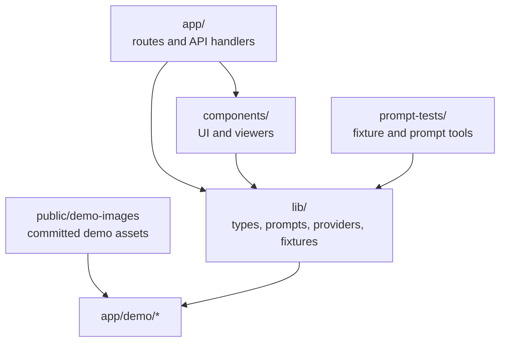

# Project Structure

Greenlight is organized around the Next app, reusable report components, generation logic, demo fixtures, and prompt-evaluation scripts.

## Application Routes

| Path | Purpose |
|---|---|
| `app/page.tsx` | Home route with JSON-LD and `WizardShell` |
| `app/demo/page.tsx` | Night of the Living Dead demo |
| `app/demo/[film]/page.tsx` | Dedicated demo pages for Get Out, Dune, Past Lives, The Favourite, Red Balloon |
| `app/share/page.tsx` | Printable full-bible view |
| `app/api/generate/*/route.ts` | Text document generation |
| `app/api/generate-image/route.ts` | Storyboard image generation |
| `app/api/generate-portrait/route.ts` | Character portrait generation |
| `app/api/generate-prop/route.ts` | Prop image generation |
| `app/api/generate-poster-image/route.ts` | Poster image generation |
| `app/api/regenerate-section/route.ts` | Focused section rewrite |
| `app/api/tmdb-search/route.ts` | Film poster lookup |
| `app/api/save-local/route.ts` | Development-only markdown save path |

## Components

| Folder | Purpose |
|---|---|
| `components/wizard/` | Start, generation, review, settings, and header menu |
| `components/viewers/` | Parsers and viewers for report sections |
| `components/share/` | Full printable report |
| `components/demo/` | Read-only demo wrapper around `StepResults` |
| `components/ui/` | Shared primitives for the report style |

## Library Layer

| File or folder | Purpose |
|---|---|
| `lib/schema.ts` | Manual screenplay JSON validation and TypeScript shape |
| `lib/reports.ts` | Saved project type and localStorage helpers |
| `lib/prompts/` | Live provider prompts |
| `lib/text-generation.ts` | Provider routing, retries, and generation calls |
| `lib/ai-providers.ts` | Provider options, model defaults, env key names |
| `lib/json-trimmer.ts` | Per-document JSON compaction |
| `lib/image-prompts.ts` | Shared image style prefixes and LoRA constants |
| `lib/demos/` | Five named demo fixture modules |
| `lib/demo-project.ts` | Default Night of the Living Dead fixture |
| `lib/cached-projects.ts` | Title-matched cached project path for EEAAO |

## Prompt Tools

| File | Purpose |
|---|---|
| `prompt-tests/scripts/build-demo-fixture.mjs` | Builds `SavedProject` fixtures from raw screenplay JSON |
| `prompt-tests/scripts/compare-role-passes.mjs` | Compares prompt/report versions |
| `prompt-tests/scripts/estimate-token-cost.mjs` | Estimates generation cost |
| `prompt-tests/scripts/visual-qa-report-nav.mjs` | Captures report navigation QA screenshots |

